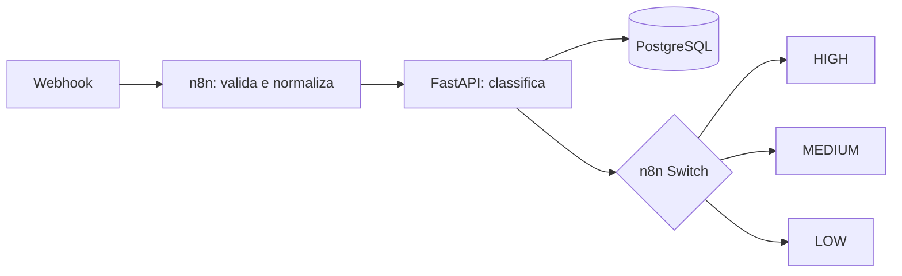

# LeadFlow AI

Automação inteligente de triagem e qualificação de leads para uma corretora de seguros.
O projeto recebe um contato por webhook, calcula sua prioridade com regras de negócio
explicáveis, persiste o resultado e indica a próxima ação comercial.

## Objetivo

Demonstrar, em um MVP pequeno e executável, a integração entre n8n, uma API REST em
Python/FastAPI e PostgreSQL. Todo o fluxo funciona localmente, sem credenciais ou
serviços externos.

## Arquitetura



Veja a descrição das responsabilidades em [docs/architecture.md](docs/architecture.md).

## Tecnologias

- Python 3.12, FastAPI, Pydantic e SQLAlchemy 2
- PostgreSQL 16
- n8n
- Pytest
- Docker Compose

## Fluxo da automação

1. O n8n recebe um `POST` no webhook `/leadflow`.
2. O node **Normalize and Validate** remove espaços, normaliza o e-mail e verifica os
   campos obrigatórios.
3. O node HTTP chama `http://api:8000/api/leads/classify`, usando o hostname interno
   do Docker Compose.
4. A API valida o payload, aplica regras determinísticas, grava o lead e retorna a
   classificação.
5. O node **Switch Priority** encaminha `HIGH`, `MEDIUM` e `LOW` para recomendações
   comerciais distintas e devolve o JSON ao chamador.

## Como executar

Pré-requisitos: Docker Desktop com Docker Compose v2.

```powershell
Copy-Item .env.example .env
docker compose up --build
```

Após os healthchecks:

- documentação da API: <http://localhost:8000/docs>
- healthcheck: <http://localhost:8000/health>
- n8n: <http://localhost:5678>

As tabelas são criadas automaticamente no início da API. Os volumes `postgres_data`
e `n8n_data` preservam os dados entre reinicializações.

## Como importar o workflow no n8n

1. Acesse <http://localhost:5678> e conclua a configuração local inicial do n8n.
2. Selecione **Import from File** e escolha `workflow/leadflow-n8n.json`.
3. Salve o workflow.
4. Para um teste manual, abra o node **Webhook**, clique em **Listen for test event** e
   use `http://localhost:5678/webhook-test/leadflow` uma vez.
5. Para uso contínuo, ative o workflow e use
   `http://localhost:5678/webhook/leadflow`.

O workflow não requer credenciais: sua única integração é a API da rede Docker.

## Como testar

Verifique a API diretamente:

```powershell
curl.exe http://localhost:8000/health
curl.exe -X POST http://localhost:8000/api/leads/classify `
  -H "Content-Type: application/json" `
  --data-binary "@examples/lead-high.json"
```

Com o workflow ativo, teste as três prioridades trocando o nome do arquivo:

```powershell
curl.exe -X POST http://localhost:5678/webhook/leadflow `
  -H "Content-Type: application/json" `
  --data-binary "@examples/lead-high.json"

curl.exe -X POST http://localhost:5678/webhook/leadflow `
  -H "Content-Type: application/json" `
  --data-binary "@examples/lead-medium.json"

curl.exe -X POST http://localhost:5678/webhook/leadflow `
  -H "Content-Type: application/json" `
  --data-binary "@examples/lead-low.json"
```

Cada resposta contém o lead persistido, `category`, `score`, `priority`, `summary` e a
`action` adicionada pelo branch do n8n.

## Critérios de classificação

O modo padrão é completamente determinístico. O score parte de 10 e soma sinais
simples:

| Sinal | Pontos |
|---|---:|
| intenção explícita de cotar ou contratar | 30 |
| contexto empresarial | 20 |
| quantidade de funcionários/vidas | 15 |
| urgência | 15 |
| telefone informado | 5 |
| tipo de seguro informado | 5 |

- `score >= 75`: **HIGH**
- `45 <= score < 75`: **MEDIUM**
- `score < 45`: **LOW**

As regras estão isoladas em `api/app/services/lead_classifier.py`, deixando o contrato
pronto para receber futuramente um adaptador LLM. Nenhuma chave OpenAI é necessária ou
utilizada neste MVP.

## Testes

Os testes cobrem um lead de cada prioridade, validação HTTP e persistência com SQLite
em memória. Eles não dependem de PostgreSQL, n8n ou internet:

```powershell
docker compose run --rm api pytest
```

Para executar localmente com Python 3.12+:

```powershell
python -m venv .venv
.\.venv\Scripts\Activate.ps1
pip install -r api/requirements.txt
Set-Location api
pytest
```

## Possíveis evoluções

- integração com CRM e enriquecimento de leads
- Microsoft 365 e Power Automate
- envio automático de e-mails
- dashboard de acompanhamento
- classificação híbrida ou completa com LLM

## Contexto de portfólio

Este projeto usa somente dados fictícios e foi criado para demonstrar automação e
integração entre ferramentas, sem utilizar dados ou código proprietário de experiências
profissionais anteriores.
