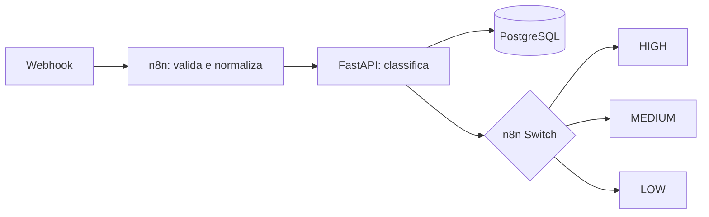

# LeadFlow AI

Automação inteligente de triagem e qualificação de leads para uma corretora de seguros,
integrando n8n, FastAPI e PostgreSQL em um fluxo local, reproduzível e demonstrável.

## O problema

Leads recebidos por diferentes canais precisam ser avaliados rapidamente para que as
oportunidades mais relevantes cheguem primeiro ao atendimento comercial. Quando essa
triagem é manual, critérios podem variar e contatos com maior intenção de contratação
podem ficar sem a prioridade adequada.

## A solução

O LeadFlow AI automatiza a entrada, normalização, classificação e persistência dos
leads. Um webhook do n8n recebe o contato, envia os dados para uma API FastAPI e
direciona o resultado para uma ação compatível com a prioridade `HIGH`, `MEDIUM` ou
`LOW`.

A classificação padrão usa regras determinísticas e explicáveis. Assim, o projeto
funciona completamente sem serviços externos ou chaves de API.

## Arquitetura



- **n8n:** recebe o webhook, normaliza os campos, chama a API e escolhe a próxima ação.
- **FastAPI:** valida o contrato, calcula score e prioridade e gera um resumo do lead.
- **PostgreSQL:** persiste os dados recebidos e o resultado da classificação.

Mais detalhes estão em [docs/architecture.md](docs/architecture.md).

## Destaques

- workflow n8n real e importável, sem dependência de credenciais;
- API REST documentada automaticamente pelo FastAPI;
- regras de classificação pequenas, legíveis e fáceis de explicar;
- persistência dos leads e das classificações no PostgreSQL;
- exemplos reproduzíveis para as três prioridades;
- execução completa com um único Docker Compose;
- testes automatizados independentes de serviços externos.

## Tecnologias

| Tecnologia | Uso no projeto |
|---|---|
| n8n | webhook, normalização, integração HTTP e roteamento por prioridade |
| Python 3.12 | implementação da API e das regras de negócio |
| FastAPI | endpoints REST, documentação e validação HTTP |
| Pydantic | validação e serialização dos payloads |
| SQLAlchemy 2 | mapeamento e persistência dos leads |
| PostgreSQL 16 | banco de dados da aplicação |
| Pytest | testes da classificação e da API |
| Docker Compose | orquestração local de PostgreSQL, API e n8n |

## Fluxo da automação

1. O n8n recebe um `POST` no webhook `/leadflow`.
2. O node **Normalize and Validate** verifica `name`, `email` e `message`, remove
   espaços e normaliza os campos.
3. O node **Classify Lead via API** envia o payload para
   `http://api:8000/api/leads/classify` pela rede interna do Docker.
4. O FastAPI valida novamente o contrato com Pydantic.
5. O classificador determina categoria, score, prioridade e resumo.
6. O lead e a classificação são persistidos no PostgreSQL.
7. O node **Switch Priority** separa o resultado em `HIGH`, `MEDIUM` ou `LOW`.
8. A branch selecionada adiciona uma recomendação comercial e responde ao webhook.

As ações retornadas são:

- **HIGH:** encaminhar imediatamente para atendimento comercial;
- **MEDIUM:** adicionar à fila de acompanhamento comercial;
- **LOW:** adicionar ao fluxo de nutrição de leads.

## Critérios de classificação

O score parte de 10 e recebe pontos por sinais objetivos encontrados no lead:

| Sinal | Pontos |
|---|---:|
| intenção explícita de cotar ou contratar | 30 |
| contexto empresarial | 20 |
| quantidade de funcionários ou vidas | 15 |
| urgência | 15 |
| telefone informado | 5 |
| tipo de seguro informado | 5 |

A prioridade é calculada pelos seguintes limites:

- `score >= 75`: **HIGH**;
- `45 <= score < 75`: **MEDIUM**;
- `score < 45`: **LOW**.

As regras ficam isoladas em `api/app/services/lead_classifier.py`, permitindo uma
evolução futura para classificação com LLM sem alterar o contrato atual da API.

## Testes e validação

O projeto possui **5 testes automatizados aprovados**, cobrindo:

- classificação de leads `HIGH`, `MEDIUM` e `LOW`;
- `GET /health`;
- validação do endpoint de classificação;
- persistência isolada com SQLite em memória;
- rejeição de payload inválido com status `422`.

Os testes não dependem de PostgreSQL, n8n ou internet:

```powershell
docker compose run --rm api pytest
```

Também foi validado manualmente, de ponta a ponta, o fluxo completo dos três cenários:
recebimento pelo webhook, chamada à API, persistência no PostgreSQL, roteamento no
Switch e resposta final do n8n.

## Como executar

Pré-requisito: Docker Desktop com Docker Compose v2.

```powershell
Copy-Item .env.example .env
docker compose up --build
```

Após a inicialização e os healthchecks:

- documentação da API: <http://localhost:8000/docs>
- healthcheck: <http://localhost:8000/health>
- n8n: <http://localhost:5678>

As tabelas são criadas automaticamente no início da API. Os volumes `postgres_data`
e `n8n_data` preservam os dados entre reinicializações.

Para testar diretamente a API com um lead de prioridade alta:

```powershell
curl.exe -X POST http://localhost:8000/api/leads/classify `
  -H "Content-Type: application/json" `
  --data-binary "@examples/lead-high.json"
```

Os arquivos `examples/lead-high.json`, `examples/lead-medium.json` e
`examples/lead-low.json` demonstram resultados diferentes e reproduzíveis.

## Como importar o workflow no n8n

1. Acesse <http://localhost:5678> e conclua a configuração local inicial do n8n.
2. Selecione **Import from File** e escolha `workflow/leadflow-n8n.json`.
3. Salve o workflow.
4. Para um teste manual, abra o node **Webhook**, clique em **Listen for test event** e
   envie o payload para `http://localhost:5678/webhook-test/leadflow`.
5. Para uso contínuo, ative o workflow e use
   `http://localhost:5678/webhook/leadflow`.

O workflow chama a API pelo hostname interno `api` e não exige credenciais de e-mail,
CRM ou qualquer outro serviço externo.

## Possíveis evoluções

- integração com CRM e enriquecimento de leads;
- integração com Microsoft 365 e Power Automate;
- envio automático de e-mails;
- dashboard de acompanhamento;
- classificação híbrida ou completa com LLM.

## Sobre o projeto

Este é um MVP de portfólio criado para demonstrar automação de processos, integração
entre ferramentas, desenvolvimento de APIs e aplicação de regras de negócio. Todos os
nomes, contatos e cenários utilizados são fictícios, sem dados ou código proprietário
de experiências profissionais anteriores.
