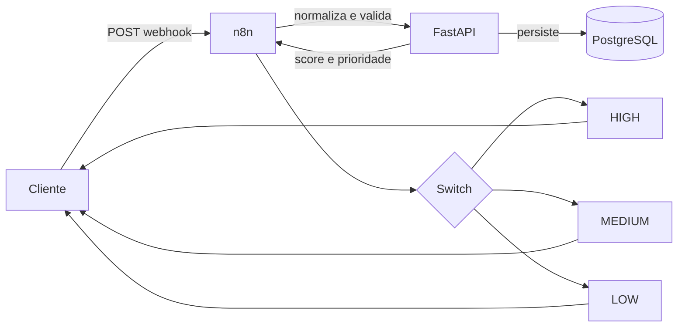

# Arquitetura

O LeadFlow AI utiliza três serviços pequenos, executados pelo Docker Compose:

## Responsabilidades

- **n8n:** recebe o webhook, normaliza os campos, chama a API e escolhe a ação comercial.
- **FastAPI:** valida o contrato, aplica regras determinísticas e grava o resultado.
- **PostgreSQL:** mantém os leads e suas classificações.

As regras ficam isoladas em `api/app/services/lead_classifier.py`. Essa separação permite
adicionar futuramente outro classificador (por exemplo, um provedor LLM) sem alterar o
contrato HTTP nem o workflow.
